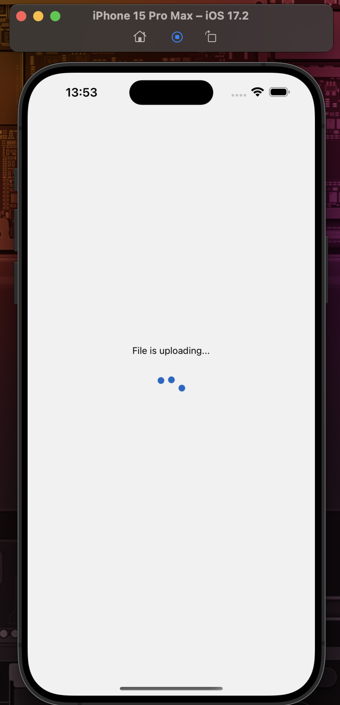

# Translator

**Translator** is a React Native-based mobile application that allows users to translate text, documents, and images into different languages using various input types. The app offers seamless translation services powered by API integrations, providing a user-friendly interface with multiple input options.

## Table of Contents
- [Features](#features)
- [Screenshots](#screenshots)
- [Installation](#installation)
- [Usage](#usage)
- [Technologies Used](#technologies-used)
- [API Endpoints](#api-endpoints)
- [Contributing](#contributing)
- [License](#license)

## Features
- **Multi-Language Support**: Translate between multiple languages.
- **Multiple Input Types**: Translate via text, documents, camera, and gallery.
- **Debounced Messaging**: Automatically translate text as the user types, minimizing API calls.
- **File Handling**: Upload and translate documents or images directly from the device.
- **Real-Time Translation**: Receive instant translations based on input.

## Screenshots
<div style="display: flex; flex-wrap: wrap; justify-content: space-between;">
    
    
    
    
    
    
</div>

## Installation

### Prerequisites
- **Node.js** (version 14 or later)
- **Expo CLI**
- **Android Studio** (for Android emulation) or **Xcode** (for iOS)

### Setup

1. **Clone the repository:**
    ```bash
    git clone https://github.com/YOUR_GITHUB_USERNAME/translator.git
    cd translator
    ```

2. **Install dependencies:**
    ```bash
    npm install
    ```

3. **Create a `.env` file:**
    ```
    BASE_URL=http://your-api-url.com
    API_KEY=your-api-key
    ```

4. **Start the project:**
    ```bash
    expo start
    ```
    or
    ```bash
    npm run ios/android/web
    ```

## Usage

1. **Choose the source and target languages** for translation.
2. **Select an input type** (text, file, camera, gallery).
3. **Submit your input** to see the translated output.

### Uploading an Image:
- Select **"Camera"** or **"Gallery"** as the input type.
- Capture or choose an image to upload for translation.

### Real-time Text Translation:
- Type your text, and the **debounced input** mechanism will trigger translation after a short delay.

## Technologies Used
- **React Native**: Mobile app development framework.
- **Expo**: Manages the React Native environment and provides access to device features.
- **Axios**: Handles HTTP requests to the translation API.
- **React Hooks**: For managing state and lifecycle events.
- **FileSystem API (Expo)**: Handles file uploads.
- **Camera and Media Library**: Captures and uploads images.

## API Endpoints

1. **Text Translation**
    ```
    POST /translate
    Body:
    {
      "q": "string",
      "source": "en",
      "target": "tr",
      "format": "text",
      "api_key": "your_api_key"
    }
    ```

2. **File, Image or Camera Input**
    ```
    POST /translate_file
    Body (multipart/form-data):
    {
      "file": <file>,
      "source": "en",
      "target": "tr",
      "api_key": "your_api_key"
    }
    ```

## Contributing

1. **Fork the project.**
2. **Create your feature branch:**
    ```bash
    git checkout -b feature/YourFeature
    ```
3. **Commit your changes:**
    ```bash
    git commit -m 'Add new feature'
    ```
4. **Push to the branch:**
    ```bash
    git push origin feature/YourFeature
    ```
5. **Open a pull request.**

## License

